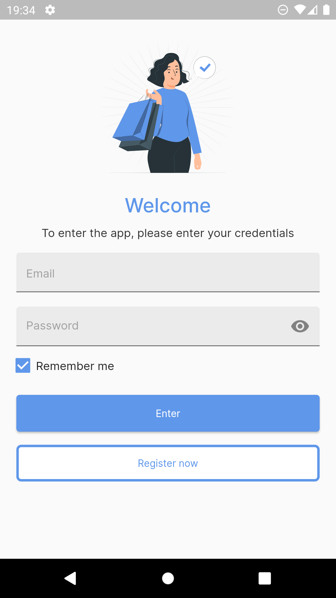
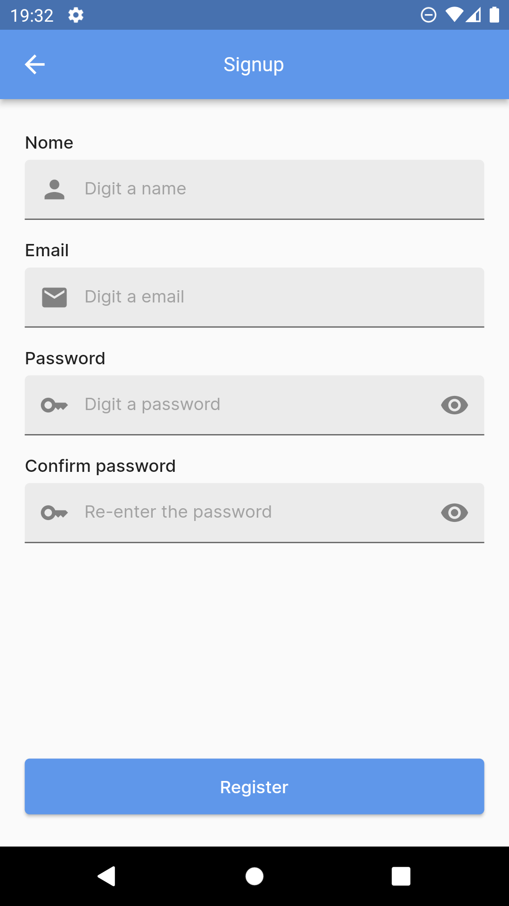
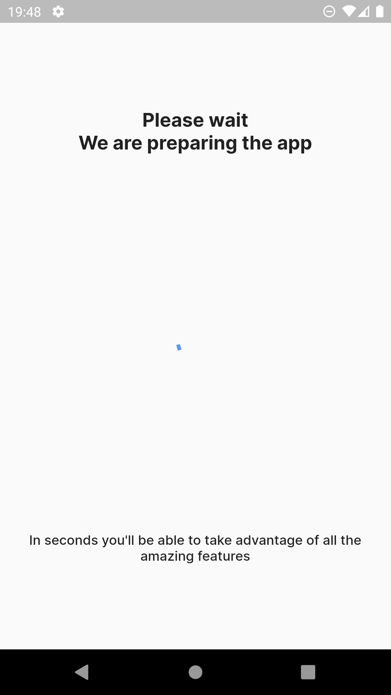
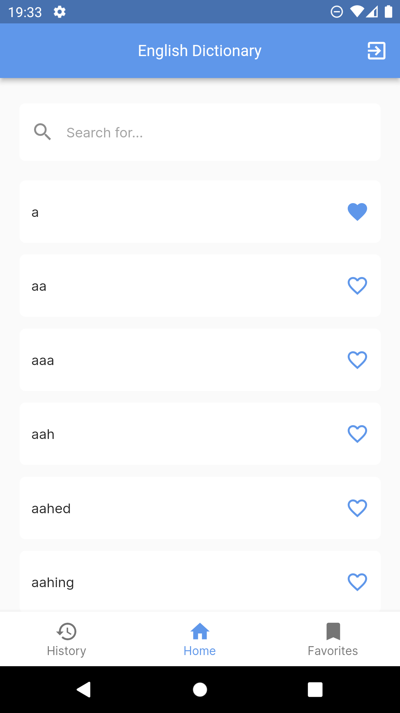
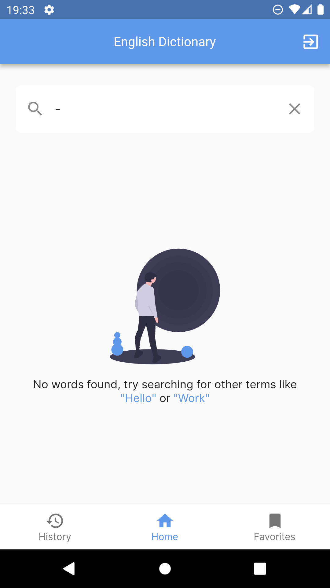
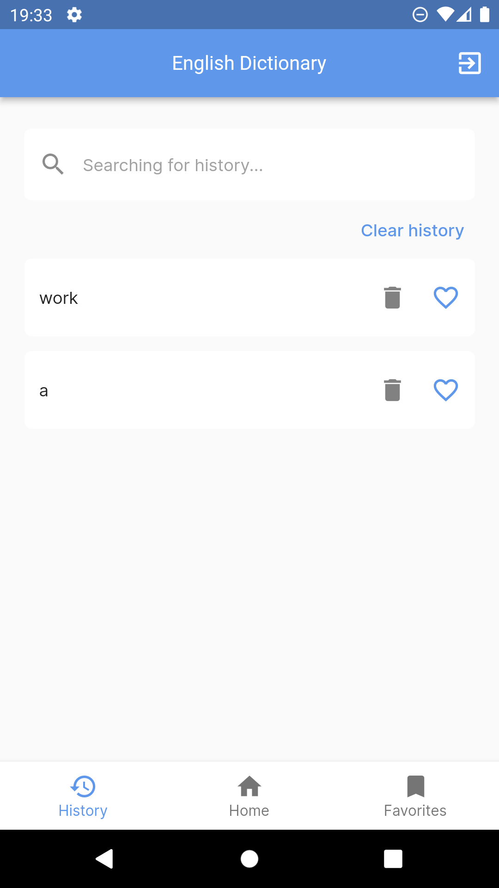
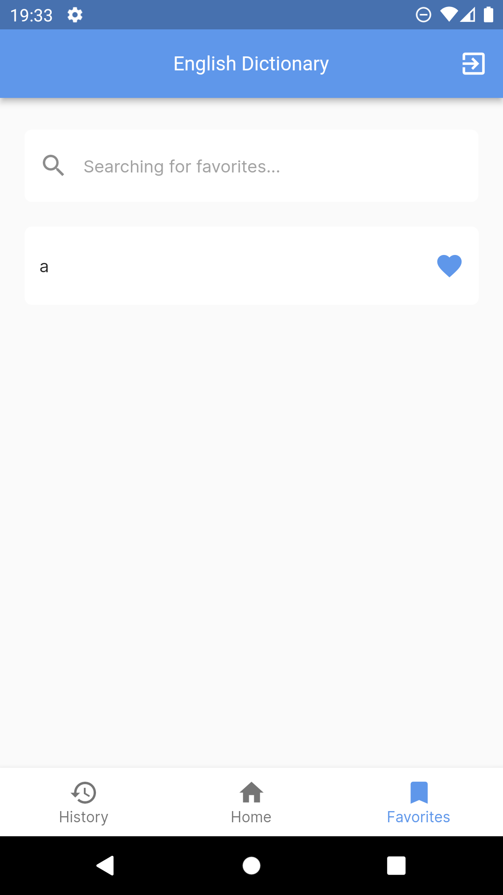
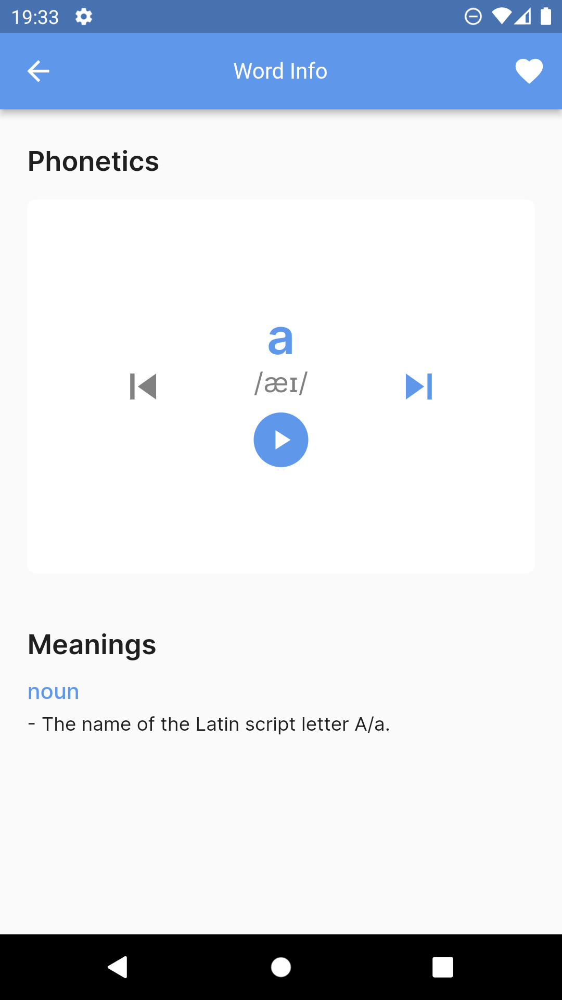

# EnglishD

Aplicativo de dicionário de palavras em inglês, com tocador de áudio

## Índice

1. [Introdução](#introdução)
2. [Tecnologias](#tecnologias)
3. [Instruções](#instruções-para-rodar)
4. [Como usar](#como-usar)

## Introdução
Este aplicativo foi desenvolvido como parte de um desafio pela Coodesh. O desafio envolveu a criação de um aplicativo de listagem de palavras em inglês que oferece a capacidade de navegar por uma lista de palavras em inglês, visualizar sua fonética e significados, além de permitir a criação de listas de palavras favoritas e rastreamento de histórico de palavras visualizadas.
## Tecnologias
>  Flutter (Mobile)

>  SQLite (Banco de dados local)

>  Firebase (Autenticação)

>  Figma (Prototipação)

>  Notion (Organização e metas)

>  Material (Estilização)

> GetIt (Injeção de dependência)

## Instruções
1. Certifique-se de ter o flutter 3.7.12 instalado, disponível em https://docs.flutter.dev/release/archive?tab=windows

2. Clone o projeto para a máquina local

3. Crie um novo projeto no firebase(https://firebase.google.com/?hl=pt)

4. Siga as etapas disponíveis da documentação do firebase CLI para conectar o projeto(https://firebase.google.com/docs/flutter/setup?authuser=0&hl=pt&platform=ios)

5. No terminal na pasta [english_dictionary] do projeto rode `flutter pub get` para sincronizar as dependências do projeto

6. Ainda no terminal, rode o comando `flutter run` para rodar o projeto

## Como usar
### **Autenticação**

1. Clique em __register now__, insira preencha os campos e clique em __register__.
2. De volta a tela de __signin__, digite as informações cadastradas anteriormente.

    
    

### **Carga inicial de dados**
1. Aguarde o processo de inicialização, ele demora apenas alguns segundos, durante esse tempo, o app estará realizando a carga de palavras no SQLite

    

### **Home, Favoritos e Histórico**
1. __Home__ - Aqui serão listadas várias palavras pré-definidas, é possível clicar nelas para ver mais detalhes, ou clicar no coração para adicioná-las aos favoritos, e também é possível pesquisar por palavras

2. __Histórico__ - Sempre que clicar em alguma palavra, ela será listada aqui. É possível apagar algumas palavras ou todas de uma vez, e realizar também as mesmas ações da __Home__

3. __Favoritos__ - As palavras marcadas como favoritas(Coração) serão listadas aqqui, e realizar também as mesmas ações da __Home__

    
    
    
    

### Informações da palavra
1. Aqui é possível ouvir a pronúncia de algumas palavras clicando no ícone de play, ver significados, e também trocar entre outros significados clicando no ícone de próximo. Além disso, é possível favoritar a palavra clicando no ícone de coração da appbar.

    

## Links úteis
- __Figma__: https://www.figma.com/file/mLeymAfyGiARjtd6NX5BWD/English-Dictionary?type=design&node-id=1%3A3&mode=design&t=1CarDZzYOcRd3wlK-1

> __This is a challenge by Coodesh__